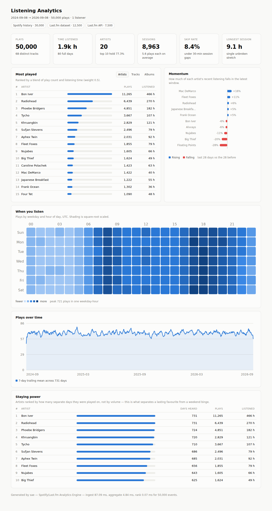

# sae — Spotify/Last.fm Analytics Engine

A C++17 engine that ingests real streaming history from Spotify and Last.fm,
folds it into hash-map accumulators in a single pass, and ranks it through
bounded priority queues to surface top artists, tracks, albums, listening
patterns and trend momentum. Ships with a CLI, a benchmark harness, a test
suite, and a zero-dependency web dashboard.

No third-party libraries. The JSON parser, the interner, the top-K structure and
the test harness are all in this repo, because the interesting part of the
problem *is* the data structures.



---

## Quick start

```bash
cmake -S . -B build -DCMAKE_BUILD_TYPE=Release
cmake --build build -j
ctest --test-dir build --output-on-failure

# generate sample data in the real source formats, then analyse it
python3 tools/make_sample.py --events 50000
./build/sae data/sample_* --out dashboard/report.json

# view it
python3 -m http.server -d dashboard 8000   # then open http://localhost:8000
```

## Using your own data

The engine reads the formats the two services actually hand out. Every file is
sniffed by content, so you can pass any mix of them in one run.

| Source | How to get it | Format flag |
|---|---|---|
| **Spotify Extended Streaming History** | Request it at [spotify.com/account/privacy](https://www.spotify.com/account/privacy) — arrives in a few days, covers your entire history with real play durations and skip flags | `spotify-extended` |
| **Spotify account-data export** | The faster, smaller download from the same page | `spotify-history` |
| **Spotify recently-played** | `tools/fetch_spotify.py --mode recent` — live, but the API keeps only the last 50 plays | `spotify-extended` |
| **Last.fm API** | `tools/fetch_lastfm.py` — your complete scrobble history, 200 rows per page | `lastfm-api` |
| **Last.fm 1K dataset** | The public [research dataset](http://ocelma.net/MusicRecommendationDataset/lastfm-1K.html) — 1,000 users, ~19M scrobbles | `lastfm-dataset` |

```bash
# Last.fm: a full scrobble history (get a key at last.fm/api/account/create)
export LASTFM_API_KEY=...
python3 tools/fetch_lastfm.py --user YOUR_USERNAME --out data/lastfm.json

# Spotify: unzip the export you requested, then merge it
python3 tools/fetch_spotify.py --mode export \
    --export-dir ~/Downloads/my_spotify_data --out data/spotify.json

# both at once — they share one catalog, so an artist you hear on both
# services aggregates into a single ranked entry
./build/sae data/spotify.json data/lastfm.json --out dashboard/report.json
```

`fetch_lastfm.py --resume` fetches only what is new since the last run, so
keeping a dataset current costs one page instead of hundreds.

## CLI

```
sae [options] <input-file>...

  -o, --out <file>        Write the report JSON (the dashboard reads this)
  -k, --top <n>           Rows per ranking                        [default: 25]
  -f, --format <name>     auto | spotify-extended | spotify-history |
                          lastfm-dataset | lastfm-api             [default: auto]
  -u, --user <name>       User label for exports that carry none  [default: me]
  -w, --time-weight <x>   0 = rank by plays, 1 = rank by listening time [default: 0.5]
  -g, --session-gap <min> Minutes of silence that end a session   [default: 30]
  -t, --trend-days <n>    Length of each trend comparison window  [default: 28]
  -q, --quiet             Suppress the console summary
```

```
$ ./build/sae data/sample_* 

50000 events · 20 artists · 68 tracks · 1914.6 h listened
8963 sessions, 5.6 plays each on average · 8.4% skipped
ingest 76.5 ms · aggregate 4.2 ms · rank 0.1 ms

Top artists
  #   name                                      plays    listened
  1   Bon Iver                                  11265     466.2 h
  2   Radiohead                                  6439     269.9 h
  3   Phoebe Bridgers                            4851     182.0 h
...
Listening by hour (UTC)
  ▁▁▁▁▁▁▂▄▆▄▃▃▃▃▃▃▄▆▇▆▅▄▃▂
  0h      6h      12h      18h     23h   (peak 3721 plays)
```

---

## How it works

```
  files ──▶ ingest ──▶ StreamEvent[] ──▶ accumulate ──▶ Aggregates ──▶ rank ──▶ Report ──▶ JSON
           (parsers)   (32B, interned)   (one O(N) pass)  (hash maps)  (heaps)            dashboard
```

### Ingest — `src/ingest.cpp`

Four parsers, one normalized `StreamEvent`. The Spotify exports are large flat
arrays, so they are read with a **streaming token scanner** (`JsonScanner`) that
pulls the eight fields the engine needs and steps over the other twenty without
allocating a node for them. Last.fm's API returns small, deeply nested pages,
so those go through a **DOM parser** where the nesting is worth the allocation.

Every string is **interned** into a dense 32-bit id on the way in. Streaming
data repeats the same few thousand artist names across millions of rows, so
interning turns every downstream aggregation key into an integer compare and
keeps a `StreamEvent` at 32 bytes with no owned allocations.

Rejected rows are counted, not silently dropped: podcasts, malformed rows and
"now playing" entries each get their own tally in the report.

### Accumulate — one pass, `src/analytics.cpp`

Events are sorted once by timestamp, then a single pass fills every accumulator
at once: per-artist / per-track / per-album counters, a weekday × hour matrix,
daily totals, per-user session state, and the two trend windows. Sessions are
tracked **per user** and split on a configurable silence gap. Because the pass
is chronological, the distinct-day set for each artist is built by appending
only when the day changes — a set for free, with no set.

### Rank — bounded heaps

Finding the top 25 of *D* artists by sorting all of them is `O(D log D)` time
and `O(D)` space. `TopK` keeps a **min-heap capped at K** instead: each
candidate costs one comparison against the current worst survivor and only
`O(log K)` when it beats it. That is `O(D log K)` time and `O(K)` space, which
is what makes it cheap enough to run a separate ranking stage over every
dimension — artists, tracks, albums, loyalty, rising, falling — in one pass over
the maps.

Each stage is just *(a map, a scoring function, a name resolver)*, so adding a
metric means adding a stage, not touching ingest or output.

### The metrics

- **Score** blends play count with listening time, `--time-weight` picking the
  mix. Time is log-damped so a few very long tracks cannot outrank a genuinely
  frequent artist, and both terms are normalised against the dataset's own
  maxima so the weight means the same thing on any input. Sources with no
  durations (Last.fm scrobbles) fall back to play counts automatically.
- **Momentum** is `(recent − prior) / (recent + prior)` over two adjacent
  windows — bounded in [−1, 1], symmetric, and still defined when either side is
  zero, which a plain ratio is not. Artists below a play floor are excluded so a
  single new play cannot top the chart.
- **Loyalty** ranks by *distinct days listened* rather than volume, which is what
  separates a lasting favourite from a weekend binge.
- **Skip rate** trusts the source when it reports skips, falls back to a
  duration threshold when it does not, and never infers skips from a source that
  carries no durations at all.

---

## Performance

`./build/sae_bench` on one core, `-O2`:

| | 50K events | 500K events |
|---|---|---|
| Accumulate | 8.4 ms (5.9 M events/s) | 135 ms (3.7 M events/s) |
| Rank (6 stages) | 2.0 ms | 16.5 ms |

Bounded top-K vs. sorting every candidate, over 3,982 distinct artists — the
benchmark asserts both produce **identical** rankings before reporting a
speedup:

| K | full sort | bounded heap | speedup |
|---|---|---|---|
| 10 | 0.299 ms | 0.027 ms | **11.2×** |
| 25 | 0.291 ms | 0.031 ms | **9.4×** |
| 100 | 0.302 ms | 0.067 ms | **4.5×** |
| 1000 | 0.300 ms | 0.296 ms | 1.0× |

The crossover at K ≈ D is the expected result, and it is the honest one to
report: the heap wins because K is small, not because sorting is slow.

## Tests

46 unit tests across the parsers, the timestamp maths, the top-K structure and
the analytics, in a ~60-line self-registering harness (`tests/test_framework.hpp`).
The ones worth knowing about:

- `topk / matches_a_full_sort_on_random_input` — bounded selection must agree
  *exactly* with the `O(N log N)` reference it replaces, at four values of K.
- `topk / ties_break_deterministically_by_key` — hash-map iteration order varies
  between runs; the tie-breaker is what makes a ranking reproducible.
- `analytics / durationless_sources_never_look_like_skips` — a Last.fm scrobble
  has `ms_played = 0`; treating that as a 0 ms play would report a 100% skip rate.
- `json / writer_emits_exactly_one_separator_between_items` — the scanner treats
  `,` as whitespace, so it is too forgiving to catch a malformed writer. This
  checks the structure the scanner ignores. It was added after that exact bug
  shipped a double comma before every key.
- `ingest / interner_ids_are_stable_across_growth` — the interner keys its table
  by views into its own storage, so growth must not invalidate them.

```bash
ctest --test-dir build --output-on-failure
```

## Dashboard

`dashboard/index.html` is a single self-contained file — no build step, no CDN,
no framework. It reads `report.json` and renders KPI tiles, the ranked lists,
a diverging momentum chart, a weekday × hour heatmap and a daily trend line with
a crosshair, in light and dark themes.

Charts follow one rule set throughout: a single categorical hue for one-series
data, a one-hue sequential ramp for the heatmap (re-stepped for the dark surface
rather than flipped), a warm/cool diverging pair for momentum, and every bar
encoding the quantity its list is actually ranked by. The palette clears
colour-blind separation and contrast checks in both modes.

Opened straight off disk, `fetch` is blocked by the browser, so the page offers
a file picker instead — serve the folder for the smooth path.

## Layout

```
include/sae/     intern.hpp  time.hpp  event.hpp  json.hpp  topk.hpp
                 ingest.hpp  analytics.hpp
src/             json.cpp  ingest.cpp  analytics.cpp  main.cpp
tests/           test_framework.hpp + 5 suites
bench/           bench.cpp
tools/           fetch_lastfm.py  fetch_spotify.py  make_sample.py
dashboard/       index.html
```

## License

MIT
